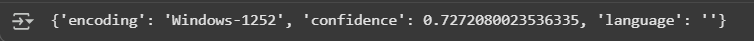
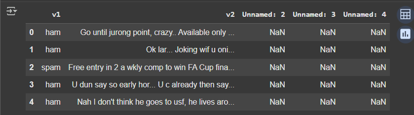
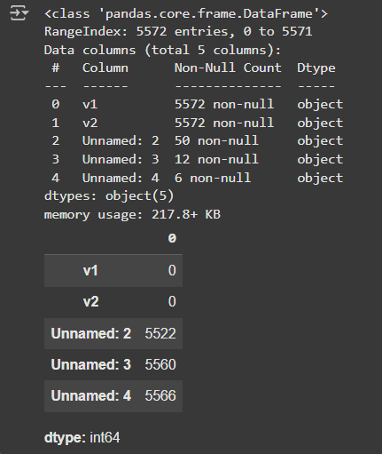
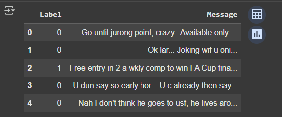
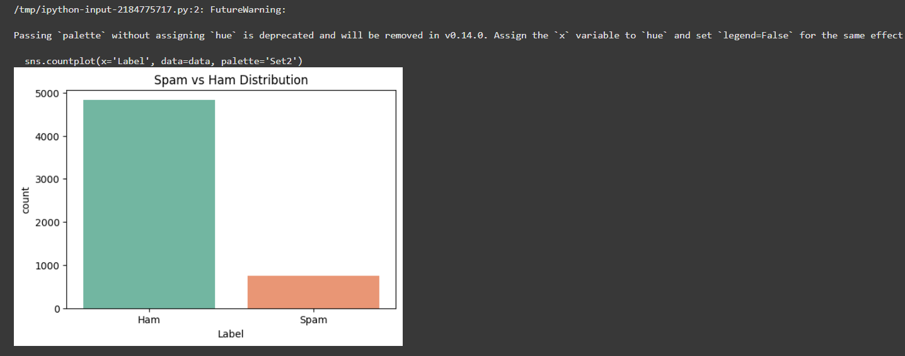
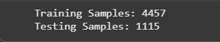
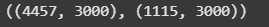
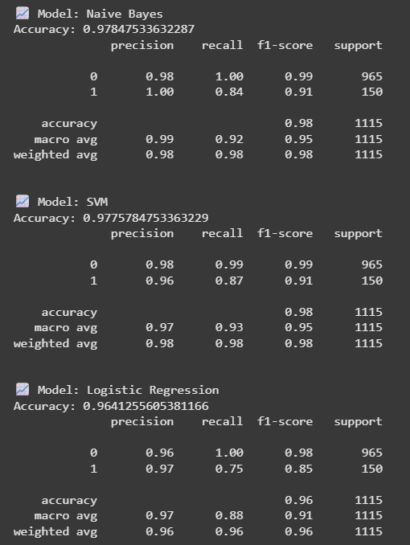
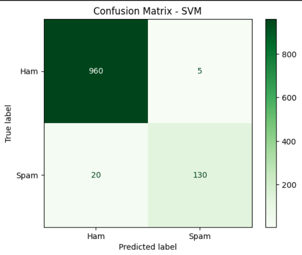
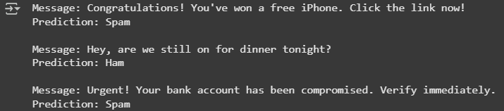

# Implementation-of-SVM-For-Spam-Mail-Detection

## AIM:
To write a program to implement the SVM For Spam Mail Detection.

## Equipments Required:
1. Hardware – PCs
2. Anaconda – Python 3.7 Installation / Jupyter notebook

## Algorithm
1. Detect File Encoding : Use chardet to determine the dataset’s encoding to avoid reading errors.

2. Load Data: Read the dataset using pandas.read_csv() with the detected encoding (Windows-1252).

3. Inspect Data: Check the dataset’s structure using .info() and detect missing/null values using .isnull().sum().

4. Clean and Prepare Data: Rename columns (v1 → Label, v2 → Message) and drop unnecessary columns. Encode labels where ham = 0 and spam = 1 using LabelEncoder.

5. Visualize Data Distribution: Use seaborn.countplot() to visualize the number of spam and ham messages.

6. Split Data: Extract text messages (X = data['Message']) and labels (y = data['Label']), then split into training and test sets using train_test_split().

7. Convert Text to Numerical Data: Use TfidfVectorizer to transform the text messages into numerical feature vectors.

8. Train SVM Model: Train a Support Vector Machine classifier using the training feature set.

9. Predict Labels: Predict the labels of test data using the trained SVM model

10. Evaluate Model: Evaluate performance using accuracy score, classification report, and confusion matrix.

11. Predict New Messages: Use the trained model to predict unseen messages and display whether each is “Spam” or “Ham.”
## Program:
/*
Program to implement the SVM For Spam Mail Detection..
Developed by:NARENDHIRAN P
RegisterNumber: 212224230177
*/
```py
import chardet
import pandas as pd
import numpy as np
import matplotlib.pyplot as plt
import seaborn as sns
```
```py
file = 'spam.csv'
with open(file, 'rb') as rawdata:
    result = chardet.detect(rawdata.read(100000))
result
```
```py
data = pd.read_csv('spam.csv', encoding='Windows-1252')
data.head()
```
```py
data.info()
data.isnull().sum()
```
```py
data = data.rename(columns={'v1':'Label', 'v2':'Message'})
data = data[['Label', 'Message']]
from sklearn.preprocessing import LabelEncoder
encoder = LabelEncoder()
data['Label'] = encoder.fit_transform(data['Label'])
data.head()
```
```py
plt.figure(figsize=(6,4))
sns.countplot(x='Label', data=data, palette='Set2')
plt.title('Spam vs Ham Distribution')
plt.xticks([0,1], ['Ham','Spam'])
plt.show()
```
```py
from sklearn.model_selection import train_test_split
X = data['Message']
y = data['Label']
X_train, X_test, y_train, y_test = train_test_split(X, y, test_size=0.2, random_state=42)
print("Training Samples:", X_train.shape[0])
print("Testing Samples:", X_test.shape[0])
```
```py
from sklearn.feature_extraction.text import TfidfVectorizer
tfidf = TfidfVectorizer(max_features=3000, stop_words='english')
X_train_tfidf = tfidf.fit_transform(X_train)
X_test_tfidf = tfidf.transform(X_test)
X_train_tfidf.shape, X_test_tfidf.shape
```
```py
from sklearn.naive_bayes import MultinomialNB
from sklearn.svm import LinearSVC
from sklearn.linear_model import LogisticRegression
from sklearn.metrics import accuracy_score, classification_report

models = {
    "Naive Bayes": MultinomialNB(),
    "SVM": LinearSVC(),
    "Logistic Regression": LogisticRegression(max_iter=200)
}

for name, model in models.items():
    model.fit(X_train_tfidf, y_train)
    y_pred = model.predict(X_test_tfidf)
    print(f"\n📈 Model: {name}")
    print("Accuracy:", accuracy_score(y_test, y_pred))
    print(classification_report(y_test, y_pred))
```
```py
from sklearn.metrics import confusion_matrix, ConfusionMatrixDisplay

best_model = LinearSVC()
best_model.fit(X_train_tfidf, y_train)
y_pred_best = best_model.predict(X_test_tfidf)

cm = confusion_matrix(y_test, y_pred_best)
disp = ConfusionMatrixDisplay(confusion_matrix=cm, display_labels=['Ham', 'Spam'])
disp.plot(cmap='Greens')
plt.title("Confusion Matrix - SVM")
plt.show()
```
```py
new_msgs = [
    "Congratulations! You've won a free iPhone. Click the link now!",
    "Hey, are we still on for dinner tonight?",
    "Urgent! Your bank account has been compromised. Verify immediately."
]
preds = best_model.predict(tfidf.transform(new_msgs))
for msg, pred in zip(new_msgs, preds):
    label = 'Spam' if pred == 1 else 'Ham'
    print(f"Message: {msg}\nPrediction: {label}\n")
```
## Output:



















## Result:
Thus the program to implement the SVM For Spam Mail Detection is written and verified using python programming.
